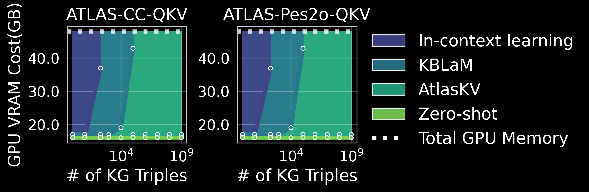

<div align="center">

# 🪐 AtlasKV: Augmenting LLMs with Billion-Scale Knowledge Graphs in 20GB VRAM

[](https://arxiv.org/abs/2510.17934)
[](https://hkustconnect-my.sharepoint.com/:f:/g/personal/hhuangcp_connect_ust_hk/EprEAhMNn5NLh7HGtb05IpQBNIkCA2JKmNB8D5KiAfLj6g?e=6im0jX)
[](https://hkustconnect-my.sharepoint.com/:f:/g/personal/hhuangcp_connect_ust_hk/EprEAhMNn5NLh7HGtb05IpQBNIkCA2JKmNB8D5KiAfLj6g?e=6im0jX)
[](https://huggingface.co/collections/HaoyuHuang2/atlaskv-68f5b2fb04fbae5be988856f)
[](https://python.org)
[](LICENSE)



**AtlasKV** is a scalable, effective, and general way to augment LLMs with billion-scale
knowledge graphs (KGs) (e.g. 1B triples) using very little GPU memory cost (e.g.
less than 20GB VRAM) while achieving superior knowledge grounding performance and strong
generalization abilities.

</div>

## 📋 Table of Contents

<details>
<summary>Click to expand full table of contents</summary>

- [🚀 Quick Start](#-quick-start)
  - [Installation](#installation)
- [📚 Data Preparation](#-data-preparation)
  - [Synthetic Dataset](#synthetic-dataset)
  - [KG2KV Dataset](#kg2kv-dataset)
- [🔥 Model Training](#️-model-training)
  - [KBLaM Training](#kblam-training)
  - [AtlasKV Training](#atlaskv-training)
- [📊 Model Evaluation](#-model-evaluation)
  - [GPU Cost Evaluation](#gpu-cost-evaluation)
  - [Knowledge Accuracy Evaluation](#knowledge-accuracy-evaluation)
  - [Generation Relevance Evaluation](#generation-relevance-evaluation)
- [💾 Pre-trained Models](#-pre-trained-models)
- [🙏 Acknowledgments](#-acknowledgments)
- [📖 Citation](#-citation)

</details>


## 🚀 Quick Start

### Installation

1. **Create and activate conda environment**
   ```bash
   conda create -n atlaskv python=3.9
   conda activate atlaskv
   ```

2. **Install AtlasKV package**
   ```bash
   git clone https://github.com/your-repo/AtlasKV.git
   cd AtlasKV
   pip install -e .
   ```

3. **Configure Hugging Face access** (required for Llama models)
   ```bash
   pip install huggingface_hub
   huggingface-cli login
   ```

## 📚 Data Preparation

AtlasKV supports two dataset construction methods:

| Method | Description |
|--------|-------------|
| **Synthetic** | Fully synthetic method proposed in KBLaM |
| **KG2KV** | KG2KV method proposed in our work |

### Supported Sentence Encoders

| Encoder | Provider |
|---------|----------|
| [text-embedding-ada-002](https://openai.com/index/new-and-improved-embedding-model/) | OpenAI |
| [all-MiniLM-L6-v2](https://huggingface.co/sentence-transformers/all-MiniLM-L6-v2) | Hugging Face |
| [text-embedding-3-large](https://openai.com/index/new-embedding-models-and-api-updates/) | OpenAI |

### Synthetic Dataset Construction

> 📥 **Pre-built Dataset**: We also provide a pre-constructed dataset download link [Synthetic](https://hkustconnect-my.sharepoint.com/:u:/g/personal/hhuangcp_connect_ust_hk/EW54a-RgFQ5Og4B2Nq3TBCcBPVeeF1fWJT_ie_bXowufsQ?e=zdOzgO)

> ⚠️ **Configuration Reminder**: Please ensure to replace all path configurations in the following scripts with your own paths.

#### Step 1: Construct Raw Synthetic Data
```bash
cd dataset_generation
bash ../experiments/scripts/data/syn_construct.sh
```

#### Step 2: Generate Knowledge Base Embeddings
Choose your preferred sentence encoder:

<details>
<summary>🔧 all-MiniLM-L6-v2</summary>

```bash
cd dataset_generation
bash ../experiments/scripts/data/syn_allminilm_embd.sh
```

</details>

<details>
<summary>🔧 text-embedding-ada-002</summary>

```bash
cd dataset_generation
bash ../experiments/scripts/data/syn_oai_embd.sh
```

</details>

<details>
<summary>🔧 text-embedding-3-large</summary>

```bash
cd dataset_generation
bash ../experiments/scripts/data/syn_bigoai_embd.sh
```

</details>

#### Step 3: Split Training and Testing Sets
Run the corresponding split script based on your chosen encoder:

```bash
cd dataset_generation
# Choose one of the following based on your encoder:
bash ../experiments/scripts/data/syn_allminilm_split.sh    # all-MiniLM-L6-v2
bash ../experiments/scripts/data/syn_oai_split.sh          # text-embedding-ada-002
bash ../experiments/scripts/data/syn_bigoai_split.sh       # text-embedding-3-large
```

#### 📁 Generated Dataset Files

After completing the above steps, you will obtain the following files:

```
📦 Dataset File Structure
├── synthetic_data_qkv.json                                    # Raw data
├── synthetic_data_qkv_[encoder]_embd_key.npy                  # Key embeddings
├── synthetic_data_qkv_[encoder]_embd_value.npy                # Value embeddings
├── train_synthetic_data_qkv.json                              # Training data
├── train_synthetic_data_qkv_[encoder]_embd_key.npy           # Training key embeddings
├── train_synthetic_data_qkv_[encoder]_embd_value.npy         # Training value embeddings
├── test_synthetic_data_qkv.json                               # Test data
├── test_synthetic_data_qkv_[encoder]_embd_key.npy             # Test key embeddings
└── test_synthetic_data_qkv_[encoder]_embd_value.npy           # Test value embeddings
```

> 💡 **Tip**: `[encoder]` will be replaced with the corresponding encoder name (e.g., `all-MiniLM-L6-v2`, `oai`, `bigoai`)

### KG2KV Dataset Construction

> 📥 **Pre-built Datasets**: 
> - [ATLAS-Wiki-QKV](https://hkustconnect-my.sharepoint.com/:u:/g/personal/hhuangcp_connect_ust_hk/ESuC-XeIUB9DvTaZ3q8LPTEBScFV2xtK55wX9pp4YuIYXg?e=KsIiIk) (based on Wikipedia)
> - [ATLAS-CC-QKV](https://hkustconnect-my.sharepoint.com/:u:/g/personal/hhuangcp_connect_ust_hk/EW9QRDd9VnpCq3i6_-Xfum8BE6Hr-sh4QGG7IrJ9x6Qi1A?e=7BZyTh) (based on Common Crawl)

#### Step 1: Construct Raw KGKV Data
```bash
cd dataset_generation
python build_atlas_training_data.py
```

#### Step 2: Generate KGKV Embeddings
Using ATLAS-Wiki as an example, choose your sentence encoder:

<details>
<summary>🔧 all-MiniLM-L6-v2</summary>

```bash
cd dataset_generation
bash ../experiments/scripts/data/wiki_allminilm_embd.sh
```

</details>

<details>
<summary>🔧 text-embedding-ada-002</summary>

```bash
cd dataset_generation
bash ../experiments/scripts/data/wiki_oai_embd.sh
```

</details>

<details>
<summary>🔧 text-embedding-3-large</summary>

```bash
cd dataset_generation
bash ../experiments/scripts/data/wiki_bigoai_embd.sh
```

</details>

#### Step 3: Split Training and Testing Sets
Using ATLAS-Wiki as an example:

```bash
cd dataset_generation
# Choose one of the following based on your encoder:
bash ../experiments/scripts/data/wiki_allminilm_split.sh    # all-MiniLM-L6-v2
bash ../experiments/scripts/data/wiki_oai_split.sh          # text-embedding-ada-002
bash ../experiments/scripts/data/wiki_bigoai_split.sh       # text-embedding-3-large
```

#### Step 4: Hierarchical Clustering on Test Data
> ⚠️ **Important Configuration**: In this step, you need to modify the script settings:
> - Change `CLUSTER=False` to `CLUSTER=True`
> - Change `GENERATING_EMBEDDINGS=True` to `GENERATING_EMBEDDINGS=False`
> - Change dataset name to test set (e.g., `your_output_path/atlas_wiki_qa.json` → `your_output_path/test_atlas_wiki_qa.json`)

```bash
cd dataset_generation
# Choose one of the following based on your encoder:
bash ../experiments/scripts/data/wiki_allminilm_embd.sh    # all-MiniLM-L6-v2
bash ../experiments/scripts/data/wiki_oai_embd.sh          # text-embedding-ada-002
bash ../experiments/scripts/data/wiki_bigoai_embd.sh       # text-embedding-3-large
```

#### 📁 Generated Dataset Files

After completing the above steps, you will obtain the following files:

```
📦 KG2KV Dataset File Structure
├── atlas_wiki_qkv.json                                    # Raw data
├── atlas_wiki_qkv_[encoder]_embd_key.npy                  # Key embeddings
├── atlas_wiki_qkv_[encoder]_embd_value.npy                # Value embeddings
├── train_atlas_wiki_qkv.json                              # Training data
├── train_atlas_wiki_qkv_[encoder]_embd_key.npy           # Training key embeddings
├── train_atlas_wiki_qkv_[encoder]_embd_value.npy         # Training value embeddings
├── test_atlas_wiki_qkv.json                               # Test data
├── test_atlas_wiki_qkv_[encoder]_embd_key.npy             # Test key embeddings
├── test_atlas_wiki_qkv_[encoder]_embd_value.npy           # Test value embeddings
├── test_atlas_wiki_qkv_[encoder]_embd_key_inter1_c2id_mapping.json    # Inter1 cluster mapping
├── test_atlas_wiki_qkv_[encoder]_embd_key_inter1_id2c_mapping.json    # Inter1 reverse mapping
├── test_atlas_wiki_qkv_[encoder]_embd_key_inter1.npy                  # Inter1 embeddings
├── test_atlas_wiki_qkv_[encoder]_embd_key_root_c2id_mapping.json      # Root cluster mapping
├── test_atlas_wiki_qkv_[encoder]_embd_key_root_id2c_mapping.json      # Root reverse mapping
└── test_atlas_wiki_qkv_[encoder]_embd_key_root.npy                    # Root embeddings
```

> 💡 **Tip**: `[encoder]` will be replaced with the corresponding encoder name (e.g., `all-MiniLM-L6-v2`, `oai`, `bigoai`)

## 🔥 Model Training

To train the model, run the following scripts:

> ⚠️ **Important**: Please ensure to replace all path configurations in the scripts with your actual paths.

### KBLaM Training

<details>
<summary>🔧 Train with text-embedding-ada-002 encoder</summary>

```bash
cd experiments
bash ../experiments/scripts/train/train_syn_OAI.sh
```

</details>

<details>
<summary>🔧 Train with text-embedding-3-large encoder</summary>

```bash
cd experiments
bash ../experiments/scripts/train/train_syn_BigOAI.sh
```

</details>

<details>
<summary>🔧 Train with all-MiniLM-L6-v2 encoder</summary>

```bash
cd experiments
bash ../experiments/scripts/train/train_syn_allminilm.sh
```

</details>

### AtlasKV Training

<details>
<summary>🔧 Train with text-embedding-ada-002 encoder</summary>

```bash
cd experiments
bash ../experiments/scripts/train/train_wiki_OAI.sh
```

</details>

<details>
<summary>🔧 Train with text-embedding-3-large encoder</summary>

```bash
cd experiments
bash ../experiments/scripts/train/train_wiki_BigOAI.sh
```

</details>

<details>
<summary>🔧 Train with all-MiniLM-L6-v2 encoder</summary>

```bash
cd experiments
bash ../experiments/scripts/train/train_wiki_allminilm.sh
```

</details>

## 📊 Model Evaluation

We use the ATLAS-CC-QKV dataset as an example for evaluation.

### GPU Cost Evaluation

We only consider the maximum GPU cost during both prefilling and decoding steps of generation. The GPU cost during the offline process of encoding KGKVs is not considered.

#### Test AtlasKV
```bash
cd experiments
bash ../experiments/scripts/test_mem/test_wiki_on_cc_bigoai.sh
```

#### Test KBLaM
```bash
cd experiments
bash ../experiments/scripts/test_mem/test_syn_on_cc_bigoai.sh
```

#### Test In-Context or Zero-Shot Learning

To test the GPU cost of in-context and zero-shot learning, simply change the `eval_mode` of any scripts in this section to `icl` or `zeroshot`.

### Knowledge Accuracy Evaluation

> ⚠️ **Configuration Required**: Before running `result_disp.py`, configure the `kb_size`, `model_str` and `your_result_save_dir`.

#### Test AtlasKV

<details>
<summary>🔧 Test with all-MiniLM-L6-v2 encoder</summary>

```bash
cd experiments
bash ../experiments/scripts/test_acc/test_wiki_on_cc_allminilm.sh
python result_disp.py
```

</details>

<details>
<summary>🔧 Test with text-embedding-ada-002 encoder</summary>

```bash
cd experiments
bash ../experiments/scripts/test_acc/test_wiki_on_cc_oai.sh
python result_disp.py
```

</details>

<details>
<summary>🔧 Test with text-embedding-3-large encoder</summary>

```bash
cd experiments
bash ../experiments/scripts/test_acc/test_wiki_on_cc_bigoai.sh
python result_disp.py
```

</details>

#### Test KBLaM

<details>
<summary>🔧 Test with all-MiniLM-L6-v2 encoder</summary>

```bash
cd experiments
bash ../experiments/scripts/test_acc/test_syn_on_cc_allminilm.sh
python result_disp.py
```

</details>

<details>
<summary>🔧 Test with text-embedding-ada-002 encoder</summary>

```bash
cd experiments
bash ../experiments/scripts/test_acc/test_syn_on_cc_oai.sh
python result_disp.py
```

</details>

<details>
<summary>🔧 Test with text-embedding-3-large encoder</summary>

```bash
cd experiments
bash ../experiments/scripts/test_acc/test_syn_on_cc_bigoai.sh
python result_disp.py
```

</details>

### Generation Relevance Evaluation

Collect the output results from the knowledge grounding accuracy evaluation scripts. Configure the paths, GPT endpoint URL, and GPT endpoint API key in `output_scorer.py`. Then run:

```bash
python output_scorer.py
```

## 💾 Model Checkpoints

We provide some training checkpoints of AtlasKV that can be directly used.

### AtlasKV trained on ATLAS-CC-QKV (3K steps)

| Model Component | Download Link |
|-----------------|---------------|
| **Main Model** | [Download](https://hkustconnect-my.sharepoint.com/:u:/g/personal/hhuangcp_connect_ust_hk/Eey7MxXfePNPmStmZRQA4iYBJv_xcVmGZ_wHLgChYzy57g?e=ImaM7c) |
| **Encoder** | [Download](https://hkustconnect-my.sharepoint.com/:u:/g/personal/hhuangcp_connect_ust_hk/ES-Oo14VbLpAi8zEaABmscgBsd8RaFJKv4WUcqRneVUr3w?e=0U7Uq1) |

### AtlasKV trained on ATLAS-Wiki-QKV (3K steps)

| Model Component | Download Link |
|-----------------|---------------|
| **Main Model** | [Download](https://hkustconnect-my.sharepoint.com/:u:/g/personal/hhuangcp_connect_ust_hk/EeK-w_V_jrBMrt2lawHLu40BYLDQG-XhXKt8fSYSUITvOA?e=OhfJPA) |
| **Encoder** | [Download](https://hkustconnect-my.sharepoint.com/:u:/g/personal/hhuangcp_connect_ust_hk/ERswmPSj8JJOg8O5HMeMG0YBzPuqJIPRe8WAiRAUS3etww?e=hkxwJI) |

> 💡 **Usage**: Download both the main model and encoder files for complete functionality.

## 🙏 Acknowledgments

We gratefully acknowledge the use of the following open-source projects in our work:

| Project | Description |
|---------|-------------|
| **[KBLaM](https://github.com/microsoft/KBLaM)** | A new method for augmenting LLMs with external knowledge. |
| **[AutoSchemaKG](https://github.com/HKUST-KnowComp/AutoSchemaKG)** | A novel framework for automatic knowledge graph construction that combines schema generation via conceptualization. |

## 📖 Citation

If you use AtlasKV in your research, please cite our paper:

```bibtex
Comming Soon
```